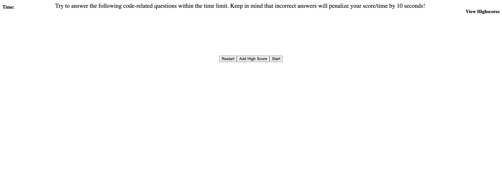

# Coding-Quiz

## Description

This assignment was for the purpose of better practicing and developing with JavaScript and understanding how to use API's in a website for dynamic functionality. I learned that there is a lot more than what the eye sees on a webpage with interactive questions, that requires a lot of syntax for the website to function. It helps solve the problem of having user data lost every time there is a refresh of site but able to re-access data from local storage.

## Table of Contents 

- [Installation](#installation)
- [Usage](#usage)
- [Credits](#credits)
- [License](#license)

## Installation

N/A

## Usage

## Credits

David R.

## License

N/A
